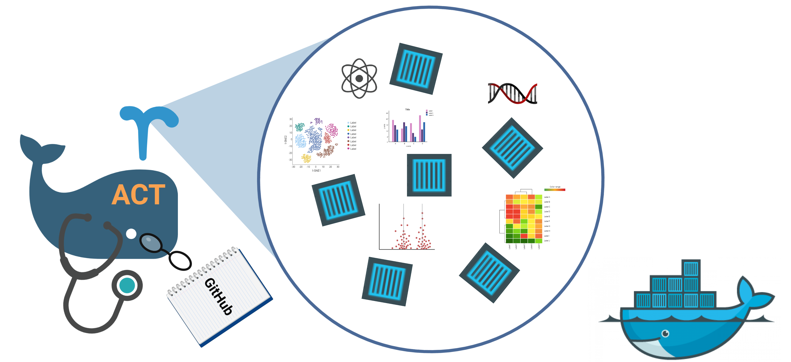

# Improving Software FAIRness and Reproducibility with Automated Containerization of GitHub Repository

# What is ACT?
ACT or **A**utomated **C**ontainerization **T**ool is a Python package that leverages the container image builder [Dockta](https://github.com/stencila/dockta) to automate the containerization of R- and Python-based GitHub repositories.

# What is containerization?

# The problem of software FAIRness and Reproducibility

# Why should this issue be addressed? (Introduction)

# The AGCT Workflow

# Installation and set up
## Dockerfile
## PIP

# Usage
## Input (URL)
## Output (Dockerfile)
## Image Registries

# How to cite
## Publication information and link

# Team Members:
* Steve Tsang
* Skyler Kuhn
* Vishal Koparde
* Austin J. Szuminsky
* Alec Peltekian
* Jason Xie
* Kimia Samieinejad
# License
MIT
