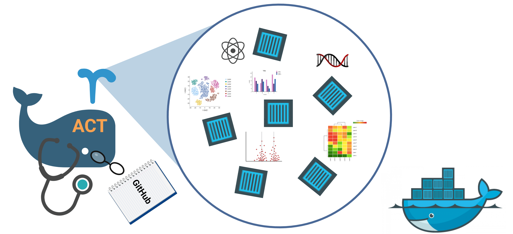

# Improving Software FAIRness and Reproducibility with Automated Containerization of GitHub Repositories



# What is ACT?
ACT or **A**utomated **C**ontainerization **T**ool is a Python package that leverages the container image builder [Dockta](https://github.com/stencila/dockta) to automate the containerization of R- and Python-based GitHub repositories.

# What is containerization?

# The problem of software FAIRness and Reproducibility

# Why should this issue be addressed? (Introduction)

# The AGCT Workflow


# Installation and set up
## Dockerfile
## PIP

# Usage

## Help menu:
```./agct -h```

## Build command (required arguments):
```./agct build --repo-url https://github.com/REPOSITORY/URL.git --img-name docker_image_name_lower_case --output ~/OP/DIRECTORY```

More options and help? ```./agct build -h```

## Push command (required arguments):
```./agct push --img-name docker_image_name_lower_case --registry DockerHub_UserName_OR_OrganizationName```

More options and help? ```./agct push -h```

## Input (URL)
## Output (Dockerfile)
## Image Registries

# How to cite
## Publication information and link

# Team Members:
* Steve Tsang
* Skyler Kuhn
* Vishal Koparde
* Austin J. Szuminsky
* Alec Peltekian
* Jason Xie
* Kimia Samieinejad
# License
MIT
