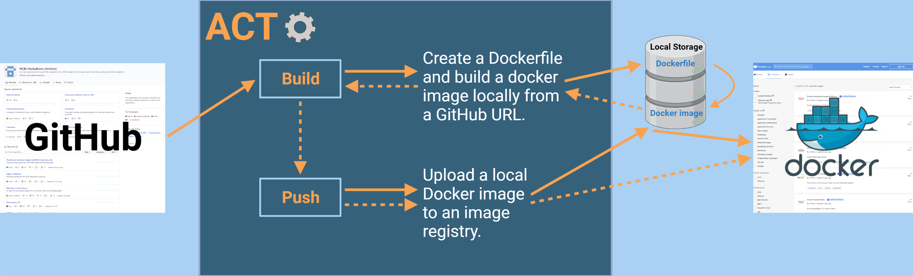

# Improving Software FAIRness and Reproducibility with Automated Containerization of GitHub Repositories


## What is ACT?
ACT or **A**utomated **C**ontainerization **T**ool is a Python package that leverages the container image builder [Dockta](https://github.com/stencila/dockta) to automate the containerization of R- and Python-based GitHub repositories.

## What is containerization?

## The problem of software FAIRness and Reproducibility

## Why should this issue be addressed? (Introduction)

## The AGCT Workflow



## Installation and Setup
### Docker image
**ACT** has a pre-built Docker image on [Docker Hub](https://hub.docker.com/repository/docker/nciccbr/strides_act). Using the **ACT** Docker image is the simplest way to run **ACT**—you need only Docker Engine installed on your computer. Please follow the instructions on the [Docker website](https://docs.docker.com/engine/install/) to install Docker Engine.

Once Docker Engine is installed, **ACT** can be run as follows:

```
$ docker run -v /var/run/docker.sock:/var/run/docker.sock -v `pwd`:/data2 nciccbr/strides_act:v1.1.0 agct build --repo-url https://github.com/CCBR/AAsap.git --img-name ccbr_aasap --output /data2/AAsap
```

### Dockerfile

A local docker image can be built using the provided [Dockerfile](https://raw.githubusercontent.com/STRIDES-Codes/ACT/main/Dockerfile). You will need Docker Engine installed on your computer for building a Docker image. Please follow the instructions the [Docker website](https://docs.docker.com/engine/install/) to install Docker Engine.

Once you have a local copy of the Dockerfile and you have Docker Engine installed, you build the docker image like this:

```
$ docker build -f Dockerfile --no-cache -t strides_act .
```
If all goes well, you should be able to list the Docker image *strides_act* using:
```
$ docker image ls
REPOSITORY    TAG    IMAGE ID    CREATED    SIZE
strides_act    <none>    32f43784742c    22 minutes ago    1.08GB
```

### Local install
If you wish to install a local copy of **ACT**, then you can run [this script](https://raw.githubusercontent.com/STRIDES-Codes/ACT/VK/utils/autocontainer-setup.sh) in our repository. We highly recommend using our Docker image for running **ACT**.

## Usage

### Help menu:
```./agct -h```

### Build command (required arguments):
```./agct build --repo-url https://github.com/REPOSITORY/URL.git --img-name docker_image_name_lower_case --output ~/OUTPUT/DIRECTORY```

More options and help? ```./agct build -h```

### Push command (required arguments):
```./agct push --img-name docker_image_name_lower_case --registry DockerHub_UserName_OR_OrganizationName```

More options and help? ```./agct push -h```

## Input (URL)
## Output (Dockerfile)
## Image Registries

# How to cite
## Publication information and link

# Team Members:
* Steve Tsang
* Skyler Kuhn
* Vishal Koparde
* Austin J. Szuminsky
* Alec Peltekian
* Jason Xie
* Kimia Samieinejad
# License
MIT
